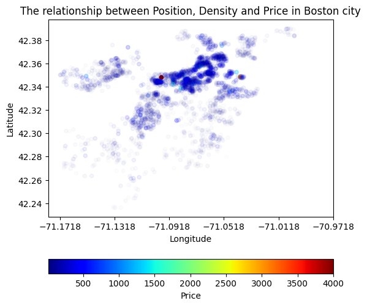
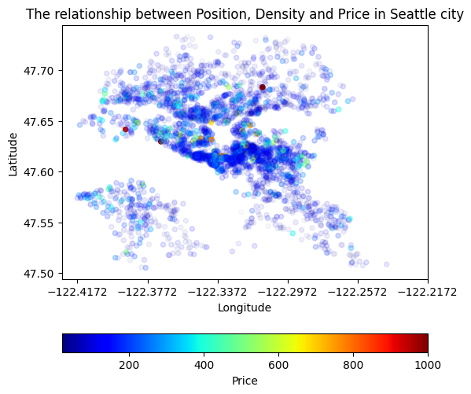
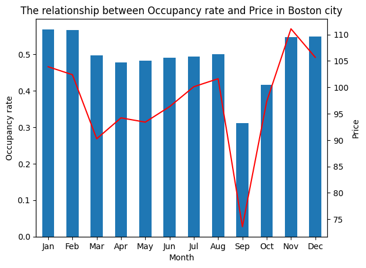
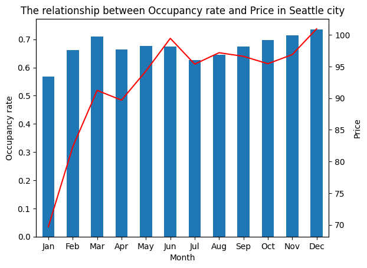

# udacity_data_scientist_airbnb

## GET_PASSES_THIS_REPO_UDACITY_PLEASE

The project in Udacity Data Scientist Course - Writing a Data Scientist Blog Post

The project analyzes about Air Bnb data of 2 cities: Boston and Seattle, provide insight about hotel price, the factor effected to price, booking decision, ...

### Library

```bash
matplotlib==3.6.2
numpy==1.23.5
pandas==1.5.1
scikit-learn==1.1.3
```

To install, please run the command:

```bash
pip install -r requirements.txt
```

### Dataset

Air Bnb Dataset of [Boston](https://www.kaggle.com/airbnb/boston) and [Seattle](https://www.kaggle.com/airbnb/seattle/data): The activity of AirBnB
Data Structure:

- `listings.csv`, including full descriptions and average review score
- `reviews.csv`, including unique id for each reviewer and detailed comments
- `calendar.csv`, including listing id and the price and availability for that day

### Motivation

Since 2008, guests and hosts have used Airbnb to travel in a more unique, personalized way. With 2 datasets from 2 different cities, I want to compare each other and to know:

- About position: How is the distribution of price by location and density of hotel?
- About time: How does the month and room occupancy affect hotel prices. Which month has the highest capacity usage and is it a holiday?
- About the host of the hotel: How does the host information affect hotel prices? The higher price whether the host is reputable?

### Project Structure

- `airbnb.ipynb`: analysis code
- `README.md`: introduction, summary about the project
- `requirements.txt`: includes used library
- `data`: dataset folder

### Result:

- Question 1: How is the distribution of price by location and density of hotel?

  - The higher of density, the higher hotel price
  - The distance from the center is so far, the price is lower
  - Boston has outlier price, the price distribution is around 1000.
  - Boston has 1 center and Seattle has 2 centers

  
  

- Question 2: How does the month and room occupancy affect hotel prices. Which month has the highest capacity usage and is it a holiday?

  - The higher occupancy rate, the higher rent price
  - The highest capacity usage in Seattle is December, and in Boston is January, both are in Christmas and New Year holiday
  - Generally, the occupancy rate in Seattle is higher than Boston, and the price is cheaper than.

  
  

- Question 3: How does the host information affect hotel prices? The higher price whether the host is reputable?
  - The host information does not affect to hotel prices

You can see the summary about it I tell on Medium [here](https://medium.com/@lenguyengiabao46/airbnb-dataset-what-does-it-want-to-say-2f24f443cf1a#a38e-f69a3db14f61)

### Licensing, Authors, Acknowledgements

- Data source: [Boston AirBnB on Kaggle](https://www.kaggle.com/airbnb/boston) and [Seattle AirBnB on Kaggle](https://www.kaggle.com/airbnb/seattle/data)

- [MIT License](./MIT-LICENSE.txt)

  README.md file that commnunites the libraries used the motivation for the project the files in the repository with a small description of each a summary of the results of the analysis necessary aclnowledgements
